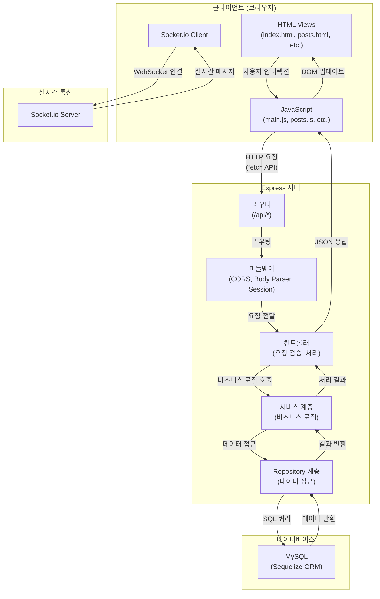
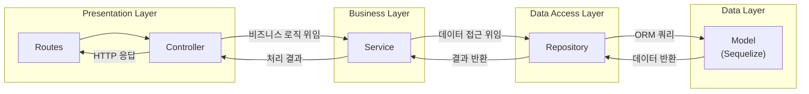
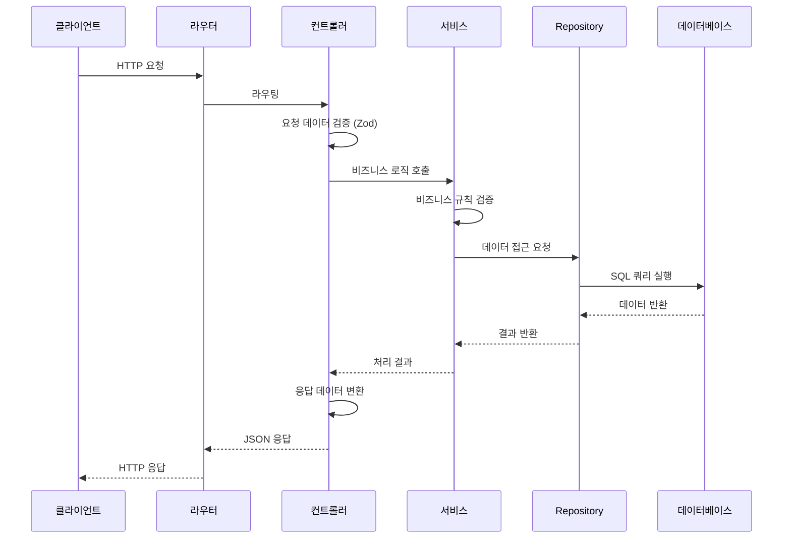
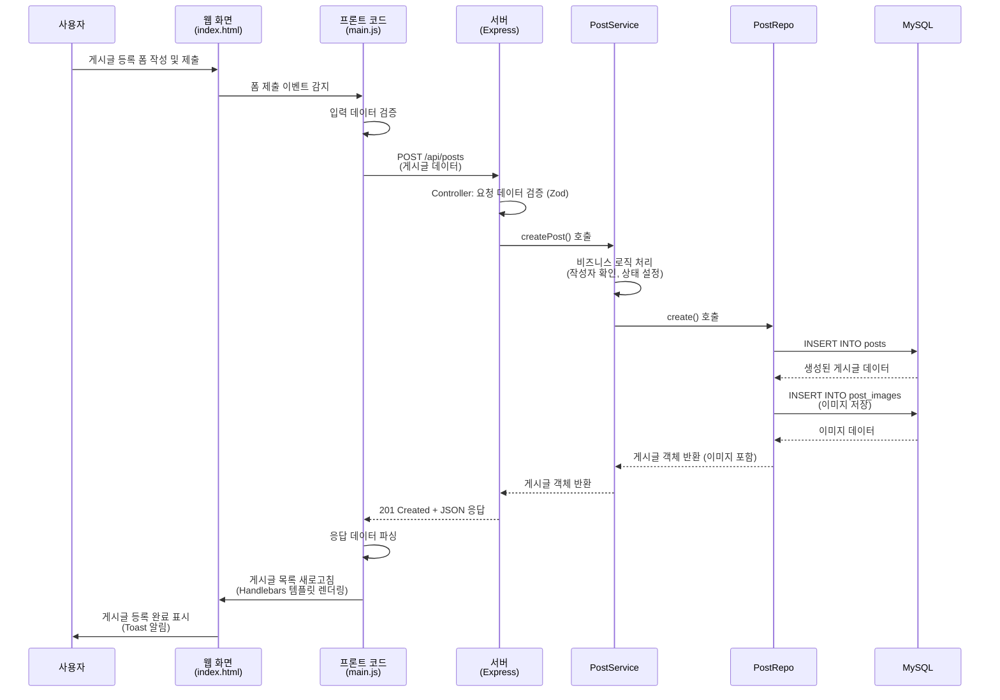

# 시스템 아키텍처 다이어그램

## 전체 시스템 아키텍처

```mermaid
flowchart TB
    subgraph Client["클라이언트 (브라우저)"]
        View["HTML Views<br/>(index.html, posts.html, etc.)"]
        Script["JavaScript<br/>(main.js, posts.js, etc.)"]
        Socket["Socket.io Client"]
    end

    subgraph Express["Express 서버"]
        Middleware["미들웨어<br/>(CORS, Body Parser, Session)"]
        Router["라우터<br/>(/api/*)"]
        Controller["컨트롤러<br/>(요청 검증, 처리)"]
        Service["서비스 계층<br/>(비즈니스 로직)"]
        Repo["Repository 계층<br/>(데이터 접근)"]
    end

    subgraph Database["데이터베이스"]
        MySQL["MySQL<br/>(Sequelize ORM)"]
    end

    subgraph RealTime["실시간 통신"]
        SocketIO["Socket.io Server"]
    end

    View -->|"사용자 인터렉션"| Script
    Script -->|"HTTP 요청<br/>(fetch API)"| Router
    Router -->|"라우팅"| Middleware
    Middleware -->|"요청 전달"| Controller
    Controller -->|"비즈니스 로직 호출"| Service
    Service -->|"데이터 접근"| Repo
    Repo -->|"SQL 쿼리"| MySQL
    MySQL -->|"데이터 반환"| Repo
    Repo -->|"결과 반환"| Service
    Service -->|"처리 결과"| Controller
    Controller -->|"JSON 응답"| Script
    Script -->|"DOM 업데이트"| View

    Socket -->|"WebSocket 연결"| SocketIO
    SocketIO -->|"실시간 메시지"| Socket
```

## 계층별 상세 흐름도

```mermaid
flowchart LR
    subgraph Layer1["Presentation Layer"]
        A1["Routes"] --> A2["Controller"]
    end

    subgraph Layer2["Business Layer"]
        B1["Service"]
    end

    subgraph Layer3["Data Access Layer"]
        C1["Repository"]
    end

    subgraph Layer4["Data Layer"]
        D1["Model<br/>(Sequelize)"]
    end

    A2 -->|"비즈니스 로직 위임"| B1
    B1 -->|"데이터 접근 위임"| C1
    C1 -->|"ORM 쿼리"| D1
    D1 -->|"데이터 반환"| C1
    C1 -->|"결과 반환"| B1
    B1 -->|"처리 결과"| A2
    A2 -->|"HTTP 응답"| A1
```

## 요청-응답 흐름 (상세)

```mermaid
sequenceDiagram
    participant Client as 클라이언트
    participant Router as 라우터
    participant Controller as 컨트롤러
    participant Service as 서비스
    participant Repo as Repository
    participant DB as 데이터베이스

    Client->>Router: HTTP 요청
    Router->>Controller: 라우팅
    Controller->>Controller: 요청 데이터 검증 (Zod)
    Controller->>Service: 비즈니스 로직 호출
    Service->>Service: 비즈니스 규칙 검증
    Service->>Repo: 데이터 접근 요청
    Repo->>DB: SQL 쿼리 실행
    DB-->>Repo: 데이터 반환
    Repo-->>Service: 결과 반환
    Service-->>Controller: 처리 결과
    Controller->>Controller: 응답 데이터 변환
    Controller-->>Router: JSON 응답
    Router-->>Client: HTTP 응답
```

---

## 게시글 등록 플로우

```mermaid
sequenceDiagram
    participant User as 사용자
    participant View as 웹 화면<br/>(index.html)
    participant Script as 프론트 코드<br/>(main.js)
    participant Server as 서버<br/>(Express)
    participant Service as PostService
    participant Repo as PostRepo
    participant DB as MySQL

    User->>View: 게시글 등록 폼 작성 및 제출
    View->>Script: 폼 제출 이벤트 감지
    Script->>Script: 입력 데이터 검증
    Script->>Server: POST /api/posts<br/>(게시글 데이터)
    Server->>Server: Controller: 요청 데이터 검증 (Zod)
    Server->>Service: createPost() 호출
    Service->>Service: 비즈니스 로직 처리<br/>(작성자 확인, 상태 설정)
    Service->>Repo: create() 호출
    Repo->>DB: INSERT INTO posts
    DB-->>Repo: 생성된 게시글 데이터
    Repo->>DB: INSERT INTO post_images<br/>(이미지 저장)
    DB-->>Repo: 이미지 데이터
    Repo-->>Service: 게시글 객체 반환 (이미지 포함)
    Service-->>Server: 게시글 객체 반환
    Server-->>Script: 201 Created + JSON 응답
    Script->>Script: 응답 데이터 파싱
    Script->>View: 게시글 목록 새로고침<br/>(Handlebars 템플릿 렌더링)
    View->>User: 게시글 등록 완료 표시<br/>(Toast 알림)
```
