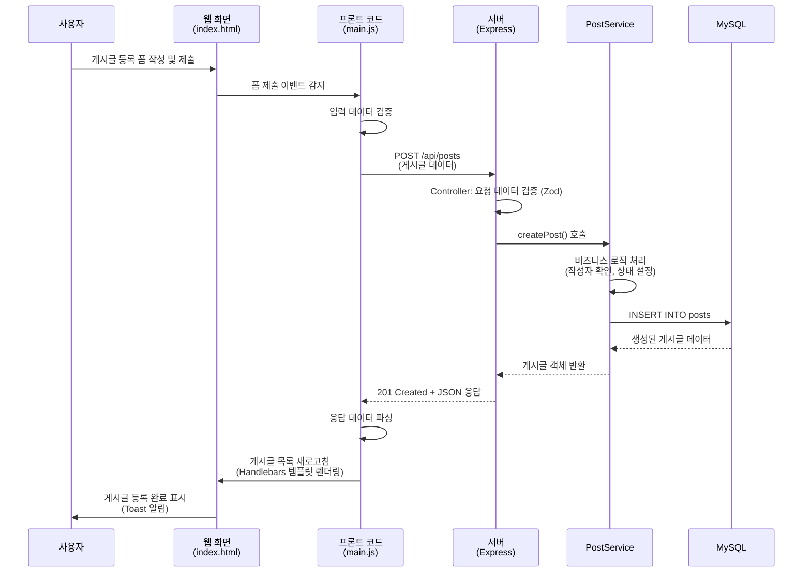
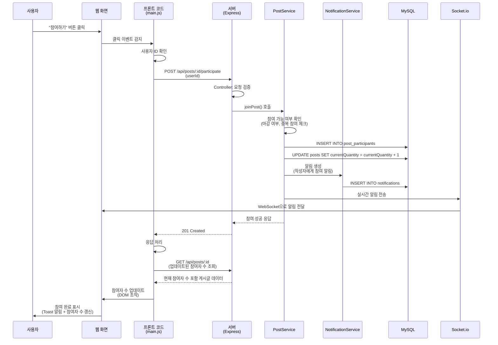
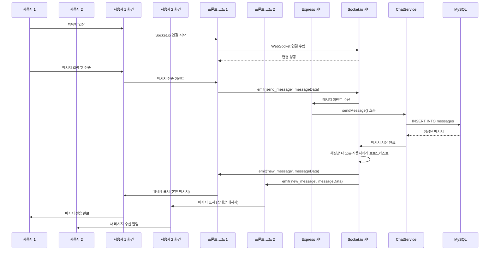
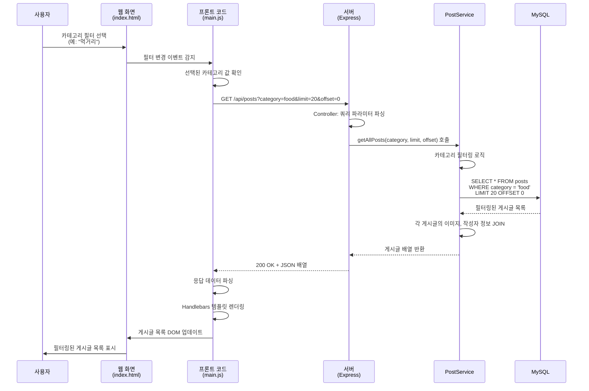
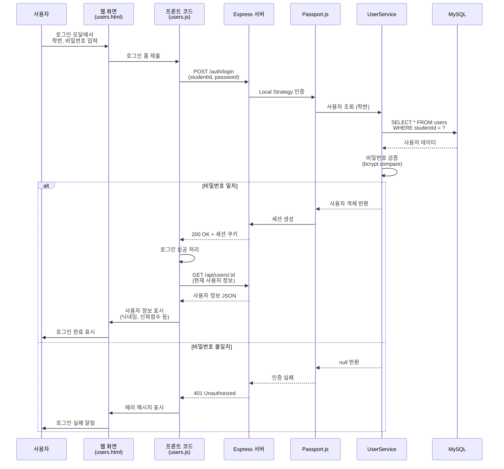
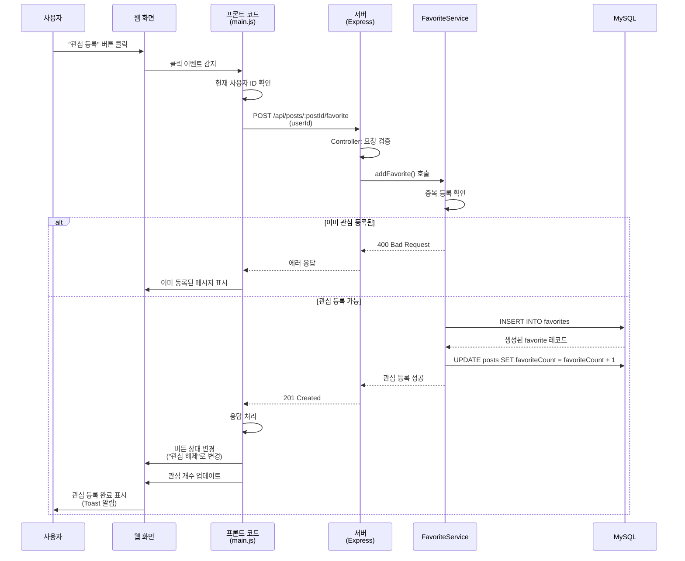
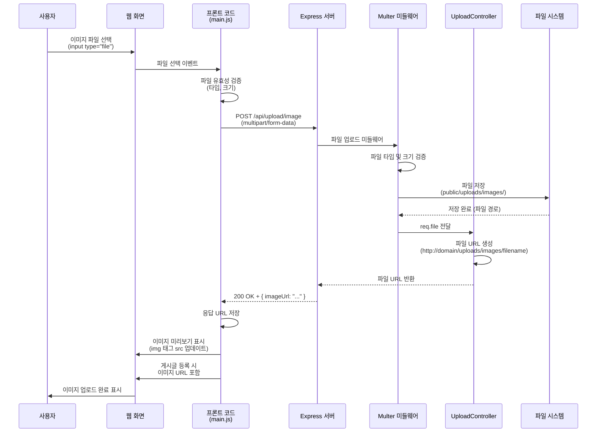
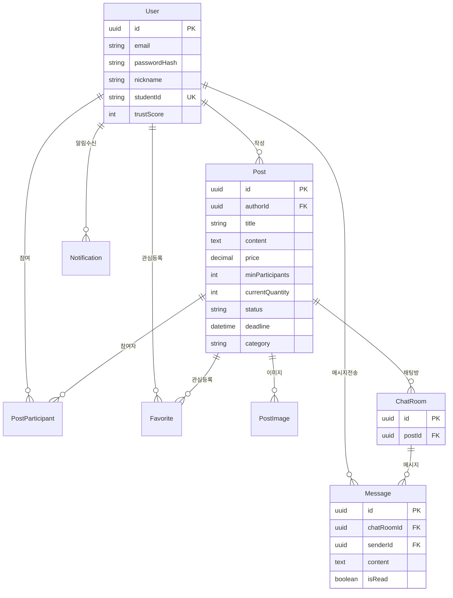

# 프로젝트 설명 문서

---

## 첫 페이지

| 항목                     | 내용                                                      |
| ------------------------ | --------------------------------------------------------- |
| **과목명**               | 고급웹프로그래밍 (Advanced Web Programming)               |
| **프로젝트 이름 (주제)** | Thomas Anderson - 공동구매 플랫폼 (Group Buying Platform) |
| **이름**                 | 최원빈                                                    |
| **학번**                 | 60203042                                                  |

---

## 1. 프로젝트 개요

**Thomas Anderson**는 명지대학교 학생들을 위한 공동구매 플랫폼입니다. 학생들이 상품을 공동으로 구매하여 할인 혜택을 누릴 수 있도록 지원하며, 실시간 채팅, 신뢰점수 시스템, 카테고리 필터링 등 다양한 기능을 제공합니다.

### 기술 스택

- **Backend**: Node.js, Express.js, TypeScript
- **Database**: MySQL (Sequelize ORM)
- **Real-time**: Socket.io
- **Authentication**: Passport.js (Local, Kakao)
- **API Documentation**: Swagger
- **Frontend**: Bootstrap, Handlebars, Vanilla JavaScript

---

## 2. 코드 구성 (폴더 별 소스코드 이름 및 기능 설명)

> ⚠️ **중요**: 이 프로젝트는 단순한 Express 구조가 아닌 **계층형 아키텍처 (Layered Architecture)**를 채택하여 **MVC 패턴**을 엄격히 준수합니다. 각 계층의 책임을 명확히 분리하여 코드의 재사용성, 유지보수성, 테스트 가능성을 크게 향상시켰습니다.

### 📐 아키텍처 개요

이 프로젝트는 **4계층 아키텍처**를 따릅니다:

```
┌─────────────────────────────────────────┐
│  Routes Layer (라우트 정의)              │
│  - HTTP 엔드포인트 정의                  │
│  - Controller 함수 연결                  │
└──────────────┬──────────────────────────┘
               │
┌──────────────▼──────────────────────────┐
│  Controller Layer (컨트롤러)            │
│  - 요청/응답 처리                        │
│  - 요청 데이터 검증 (Zod)                │
│  - Service 계층 호출                     │
│  - 에러 처리                             │
└──────────────┬──────────────────────────┘
               │
┌──────────────▼──────────────────────────┐
│  Service Layer (비즈니스 로직)          │
│  - 도메인 규칙 구현                      │
│  - 비즈니스 로직 처리                    │
│  - Repository 계층 호출                  │
│  - 트랜잭션 관리                         │
└──────────────┬──────────────────────────┘
               │
┌──────────────▼──────────────────────────┐
│  Repository Layer (데이터 접근)         │
│  - Sequelize ORM 쿼리 실행              │
│  - 복잡한 JOIN 및 집계                   │
│  - 데이터 변환 및 매핑                   │
└──────────────┬──────────────────────────┘
               │
┌──────────────▼──────────────────────────┐
│  Model Layer (데이터 모델)              │
│  - Sequelize 모델 정의                   │
│  - 테이블 관계 설정                      │
│  - 타입 정의                             │
└─────────────────────────────────────────┘
```

---

### 🔧 인프라 및 설정

#### 📁 `server.ts` - 서버 진입점

**역할**: Express 애플리케이션의 실행만 담당하며, `app.ts`와 책임을 명확히 분리합니다.

**주요 기능**:

- Express 애플리케이션 구동
- 데이터베이스 연결 및 초기화 (순차 실행 보장)
- Socket.io 서버 설정
- HTTP 서버 시작

**특별한 설계 포인트**:

1. ✅ **순차적 초기화 패턴 (Sequential Initialization)**

   - DB 연결 → DB Sync → HTTP 서버 생성 → Socket.io 초기화 → 서버 시작
   - 각 단계가 완료된 후 다음 단계로 진행하여 초기화 실패 시 조기 감지

2. ✅ **조기 장애 발견 (Fail-Fast Principle)**

   - DB 연결 실패 시 서버를 시작하지 않음
   - 에러 발생 시 적절한 로깅 후 프로세스 종료
   - 잘못된 상태의 서버가 실행되는 것을 방지

3. ✅ **Express와 Socket.io 통합**

   - `createServer(app)`을 통해 HTTP 서버를 명시적으로 생성
   - 같은 HTTP 서버 인스턴스를 Socket.io와 공유
   - WebSocket 업그레이드를 위한 올바른 구조

4. ✅ **책임 분리 (Separation of Concerns)**

   - `app.ts`: Express 설정 및 미들웨어 구성
   - `server.ts`: 서버 실행 및 초기화 순서 관리
   - 환경별로 다른 server 파일을 사용 가능한 구조

5. ✅ **비동기 초기화 관리**
   - `async/await`를 사용한 순차적 초기화
   - try-catch로 초기화 실패 시 적절한 에러 처리
   - 프로세스 종료 전 모든 에러 정보 로깅

**코드 예시**:

```typescript
async function startServer() {
  try {
    // 1. DB 연결 확인 (실패 시 즉시 종료)
    await connectDB();

    // 2. DB Sync (테이블 생성/업데이트)
    await syncDatabase();

    // 3. HTTP 서버 생성 (Express + Socket.io 통합)
    const httpServer = createServer(app);

    // 4. Socket.io 초기화
    const io = setupSocketIO(httpServer);

    // 5. 모든 준비가 끝난 후 서버 시작
    httpServer.listen(PORT, () => {
      logger.info(`Server is running on port ${ENV.Port}`);
    });
  } catch (error) {
    // 조기 실패: 에러 로깅 후 프로세스 종료
    logger.err("Failed to start server");
    logger.err(error, true);
    process.exit(1);
  }
}
```

- **책임 분리**: `server.ts`는 실행만 담당, `app.ts`는 설정 담당

#### 📁 `app.ts` - Express 애플리케이션 설정

**역할**: Express 애플리케이션의 모든 설정(미들웨어, 라우팅, 에러 처리)을 담당하며, `server.ts`와 책임을 분리합니다.

**주요 기능**:

- 미들웨어 설정 (CORS, Body Parser, Session, Passport)
- 정적 파일 제공
- 라우터 등록
- 글로벌 에러 핸들러
- Swagger 문서 설정
- 데이터베이스 Sync 함수

**특별한 설계 포인트**:

1. ✅ **최적화된 미들웨어 순서 (Middleware Chain Ordering)**

   ```
   CORS → 로깅 → Body Parser → Session/Passport → 정적 파일 → 뷰 → 라우터 → 에러 핸들러
   ```

   - CORS를 가장 먼저 배치하여 모든 요청에 대해 CORS 헤더 적용
   - Body Parser 전에 로깅을 배치하여 요청 추적
   - 라우터 전에 모든 미들웨어 설정 완료
   - 에러 핸들러를 마지막에 배치하여 모든 에러를 중앙 처리

2. ✅ **커스텀 CORS 미들웨어 (완전 무적 모드)**

   - 프리플라이트(OPTIONS) 요청을 직접 처리하여 불필요한 지연 제거
   - 동적 Origin 허용 (요청 origin 자동 인식)
   - Credentials 지원으로 세션 기반 인증 가능
   - 개발 편의성을 위한 완전 개방 모드 (프로덕션에서는 특정 origin 제한 권장)

3. ✅ **다층 로깅 시스템**

   - `morgan`: HTTP 요청 로깅 (Apache combined format)
   - 커스텀 디버깅 미들웨어: 모든 요청의 파라미터, 쿼리, 바디를 상세 로깅
   - 개발 환경에서 요청 추적 및 디버깅 용이

4. ✅ **모델 자동 등록 전략**

   - 모든 Sequelize 모델을 상단에서 import
   - Sequelize가 자동으로 테이블 관계를 인식
   - 모델 간 Association 자동 설정

5. ✅ **글로벌 에러 핸들러 (Centralized Error Handling)**

   - 커스텀 에러(`RouteError`)와 일반 에러를 구분 처리
   - 일관된 에러 응답 형식 보장
   - 모든 미처리 에러를 중앙에서 로깅 및 응답

6. ✅ **라우트 자동 감지 및 검증**

   - 서버 시작 후 등록된 라우트를 자동으로 추출 및 로깅
   - 특정 라우트 존재 여부를 자동 검증 (예: PATCH /:id/status)
   - 개발 중 라우트 등록 확인 용이

7. ✅ **유연한 DB Sync 전략**

   - 환경 변수(`DB_FORCE_SYNC`)에 따라 동작 변경
   - `force: true`: 모든 테이블 삭제 후 재생성 (개발/테스트용)
   - `alter: true`: 기존 데이터 유지하며 테이블 구조 업데이트 (프로덕션 권장)
   - 에러 발생 시 적절한 처리 및 로깅

8. ✅ **정적 파일과 뷰 라우팅 분리**
   - 정적 파일: `/public/*` 경로로 자동 제공
   - 뷰 파일: 명시적 라우트 정의 (`/`, `/users`, `/posts`, `/chat`)
   - RESTful API와 웹 페이지 라우팅 명확히 분리

**미들웨어 체인 구조**:

```typescript
// 1. CORS (가장 먼저)
app.use(customCORS);

// 2. 로깅
app.use(morgan("combined"));
app.use(debuggingMiddleware);

// 3. Body Parsing
app.use(express.json());
app.use(express.urlencoded({ extended: true }));

// 4. 인증
app.use(session({...}));
app.use(passport.initialize());
app.use(passport.session());

// 5. 정적 파일 & 뷰
app.use(express.static(...));
app.get("/", ...);

// 6. API 라우터
app.use("/api", BaseRouter);

// 7. 에러 핸들러 (마지막)
app.use(globalErrorHandler);
```

---

### 🛣️ Routes Layer (라우트 정의 계층)

**역할**: HTTP 엔드포인트를 정의하고 각 요청을 적절한 Controller 함수로 라우팅합니다.

#### 📁 `routes/index.ts` - 라우트 통합

- 모든 API 라우터를 `/api` 경로 하위에 통합
- 모듈별 라우터 등록 (User, Post, Upload, Chat, Notification)

#### 📁 `routes/users/UserRoutes.ts` - 사용자 관련 API

- `GET /api/users` - 전체 사용자 조회 (페이징)
- `POST /api/users` - 회원가입
- `POST /api/users/login` - 로그인 (학번 + 비밀번호)
- `GET /api/users/:id` - 사용자 정보 조회
- `PUT /api/users/:id` - 회원 정보 수정
- `DELETE /api/users/:id` - 회원 삭제
- `GET /api/users/:userId/favorites` - 관심 등록한 게시글 목록

#### 📁 `routes/posts/PostRoutes.ts` - 게시글 관련 API

- `GET /api/posts` - 전체 게시글 조회 (카테고리 필터링, 페이징)
- `GET /api/posts/student/:studentId` - 학번별 게시글 조회
- `GET /api/posts/:id` - 게시글 상세 조회
- `POST /api/posts` - 게시글 등록
- `PUT /api/posts/:id` - 게시글 수정
- `PATCH /api/posts/:id/status` - 게시글 상태 변경
- `DELETE /api/posts/:id` - 게시글 삭제
- `POST /api/posts/:id/participate` - 공동구매 참여
- `DELETE /api/posts/:id/participate/:userId` - 참여 취소
- `GET /api/posts/:id/participants` - 참여자 목록
- `POST /api/posts/:postId/favorite` - 관심 등록
- `DELETE /api/posts/:postId/favorite/:userId` - 관심 해제

#### 📁 `routes/chat/ChatRoutes.ts` - 채팅 관련 API

- `POST /api/chat/rooms` - 채팅방 생성
- `GET /api/chat/rooms/user/:userId` - 사용자의 채팅방 목록
- `GET /api/chat/rooms/post/:postId` - 게시글별 채팅방 조회/생성
- `GET /api/chat/rooms/:id` - 채팅방 상세 조회
- `POST /api/chat/messages` - 메시지 전송
- `GET /api/chat/rooms/:chatRoomId/messages` - 메시지 목록 조회
- `PATCH /api/chat/messages/:id/read` - 메시지 읽음 처리
- `PATCH /api/chat/rooms/:chatRoomId/read-all` - 전체 읽음 처리
- `GET /api/chat/rooms/:chatRoomId/unread-count` - 읽지 않은 메시지 수

#### 📁 `routes/upload/UploadRoutes.ts` - 파일 업로드 API

- `POST /api/upload/image` - 이미지 업로드 (Multer)

#### 📁 `routes/notifications/NotificationRoutes.ts` - 알림 관련 API

- `GET /api/notifications/user/:userId` - 사용자 알림 목록
- `PATCH /api/notifications/:id/read` - 알림 읽음 처리

#### 📁 `routes/auth/AuthRoutes.ts` - 인증 관련 라우트

- `POST /auth/login` - 세션 기반 로그인 (Local, Kakao)
- `POST /auth/logout` - 로그아웃

#### 📁 `routes/common/validation/` - 요청 검증 스키마

- `parseReq.ts` - **Zod를 이용한 런타임 타입 검증 유틸리티** (중요!)
  - 컴파일 타임과 런타임 타입 안전성 동시 확보
  - TypeScript 타입과 Zod 스키마를 통합한 검증 시스템
- `user-schemas.ts` - 사용자 관련 Zod 스키마
- `post-schemas.ts` - 게시글 관련 Zod 스키마
- `chat-schemas.ts` - 채팅 관련 Zod 스키마
- `post-status-schemas.ts` - 게시글 상태 변경 스키마

---

### 🎮 Controller Layer (컨트롤러 계층)

**역할**: HTTP 요청을 받아 요청 데이터를 검증하고, Service 계층을 호출하여 비즈니스 로직을 실행한 후 응답을 반환합니다.

**주요 파일**:

- `user.controller.ts` - 사용자 관련 요청 처리
- `post.controller.ts` - 게시글 관련 요청 처리
- `chat.controller.ts` - 채팅 관련 요청 처리
- `favorite.controller.ts` - 관심 등록 관련 로직 처리
- `notification.controller.ts` - 알림 관련 로직 처리
- `upload.controller.ts` - 파일 업로드 처리

**책임**:

1. ✅ **요청 데이터 검증**: `parseReq()` 유틸리티를 사용하여 Zod 스키마로 검증
2. ✅ **Service 계층 호출**: 비즈니스 로직 처리를 Service에 위임
3. ✅ **응답 데이터 변환**: Service 결과를 HTTP 응답 형식으로 변환
4. ✅ **에러 처리**: 에러를 `next()`로 전달하여 글로벌 에러 핸들러에서 처리

**컨벤션 예시**:

```typescript
export async function createPost(
  req: Request,
  res: Response,
  next: NextFunction
) {
  try {
    // 1. 요청 데이터 검증 (Zod)
    const validatedData = parseReq(createPostSchema)(req.body);

    // 2. Service 계층 호출
    const post = await PostService.createPost(validatedData.post, imageUrls);

    // 3. 응답 반환
    res.status(HttpStatusCodes.CREATED).json(post);
  } catch (error) {
    // 4. 에러는 글로벌 핸들러로 위임
    next(error);
  }
}
```

---

### 💼 Service Layer (서비스 계층)

**역할**: 도메인 규칙과 비즈니스 로직을 구현합니다. 여러 Repository를 조합하여 복잡한 비즈니스 로직을 처리합니다.

**주요 파일**:

- `UserService.ts` - 사용자 관련 비즈니스 로직
  - 회원가입 시 비밀번호 해시화 (bcrypt)
  - 로그인 인증 처리
  - 신뢰점수 계산 및 업데이트
- `PostService.ts` - 게시글 관련 비즈니스 로직
  - 게시글 생성/수정/삭제
  - 상태 변경 로직 (유효한 상태 전이 검증)
  - 참여자 관리
  - 카테고리 필터링
- `ChatService.ts` - 채팅 관련 비즈니스 로직
  - 채팅방 생성 및 관리
  - 메시지 전송 및 읽음 처리
  - Socket.io 실시간 통신 연동
- `FavoriteService.ts` - 관심 등록 관련 로직
- `NotificationService.ts` - 알림 생성 및 관리

**책임**:

1. ✅ **도메인 규칙 처리**: 비즈니스 로직 검증 (예: 참여 가능 여부, 상태 전이 규칙)
2. ✅ **Repository 계층 호출**: 데이터 접근을 Repository에 위임
3. ✅ **트랜잭션 관리**: 여러 데이터베이스 작업의 원자성 보장
4. ✅ **에러 처리**: 커스텀 에러 (`RouteError`)를 throw하여 Controller로 전달

**컨벤션 예시**:

```typescript
export const PostService = {
  async createPost(data: PostCreationAttributes, imageUrls: string[] = []) {
    // 1. 비즈니스 규칙 검증
    const author = await UserModel.findByPk(data.authorId);
    if (!author) {
      throw new RouteError(HttpStatusCodes.NOT_FOUND, "AUTHOR_NOT_FOUND");
    }

    // 2. Repository 계층 호출
    const post = await PostRepo.create(data, imageUrls);
    return post?.get();
  },
};
```

---

### 💾 Repository Layer (저장소 계층)

**역할**: 데이터베이스 접근 로직을 캡슐화합니다. Sequelize ORM을 사용하여 SQL 쿼리를 추상화합니다.

**주요 파일**:

- `UserRepo.ts` - 사용자 데이터 접근
- `PostRepo.ts` - 게시글 데이터 접근
- `ChatRoomRepo.ts` - 채팅방 데이터 접근
- `MessageRepo.ts` - 메시지 데이터 접근
- `FavoriteRepo.ts` - 관심 등록 데이터 접근
- `NotificationRepo.ts` - 알림 데이터 접근
- `PostParticipantRepo.ts` - 게시글 참여자 데이터 접근

**책임**:

1. ✅ **데이터베이스 쿼리 실행**: Sequelize ORM을 통한 CRUD 작업
2. ✅ **복잡한 JOIN 및 집계**: 여러 테이블을 조인한 복잡한 쿼리 처리
3. ✅ **데이터 변환 및 매핑**: Sequelize 모델을 일반 객체로 변환

**컨벤션 예시**:

```typescript
export const PostRepo = {
  async create(data: PostCreationAttributes, imageUrls: string[] = []) {
    // 1. 게시글 생성
    const post = await PostModel.create(data);

    // 2. 이미지 저장 (관계 데이터)
    if (imageUrls.length > 0) {
      await PostImageModel.bulkCreate(/* ... */);
    }

    // 3. 관계 데이터 포함하여 조회
    return await PostModel.findByPk(post.id, {
      include: [{ model: PostImageModel, as: "images" }],
    });
  },
};
```

---

### 🗄️ Model Layer (모델 계층)

**역할**: 데이터베이스 테이블의 구조와 관계를 정의합니다. TypeScript 타입과 Sequelize 모델을 함께 정의하여 타입 안전성을 확보합니다.

**주요 파일**:

- `User.ts` - 사용자 모델
  - 필드: id, email, passwordHash, nickname, studentId, department, avatarUrl, trustScore
  - TypeScript 타입: `UserAttributes`, `UserCreationAttributes`
- `Post.ts` - 게시글 모델
  - 필드: id, authorId, title, content, price, minParticipants, currentQuantity, status, deadline, pickupLocation, category
  - TypeScript 타입: `PostAttributes`, `PostCreationAttributes`
- `PostImage.ts` - 게시글 이미지 모델
- `ChatRoom.ts` - 채팅방 모델
- `Message.ts` - 메시지 모델
- `PostParticipant.ts` - 게시글 참여자 모델
- `Favorite.ts` - 관심 등록 모델
- `Notification.ts` - 알림 모델

**책임**:

1. ✅ **Sequelize 모델 정의**: 데이터베이스 테이블 구조 정의
2. ✅ **테이블 관계 설정**: Association을 통한 외래키 관계 정의
3. ✅ **타입 정의**: TypeScript 인터페이스와 타입 정의로 컴파일 타임 타입 안전성 확보

**컨벤션 예시**:

```typescript
// TypeScript 타입 정의
export interface PostAttributes {
  id: string;
  authorId: string;
  title: string;
  // ...
}

export type PostCreationAttributes = Optional<
  PostAttributes,
  "id" | "createdAt"
>;

// Sequelize 모델 정의
export class PostModel extends Model<PostAttributes, PostCreationAttributes> {
  // ...
}
```

---

### ⚙️ Config (설정 파일)

#### 📁 `config/passport.ts` - Passport.js 인증 설정

- Local Strategy (학번 + 비밀번호)
- Kakao Strategy (카카오 소셜 로그인)

#### 📁 `config/socket.ts` - Socket.io 설정

- 실시간 채팅 연결 관리
- 이벤트 핸들러 설정

#### 📁 `config/multer.ts` - 파일 업로드 설정

- 이미지 업로드 디렉토리 설정
- 파일 타입 및 크기 제한

#### 📁 `config/swagger.ts` - Swagger API 문서 설정

- OpenAPI 3.0 스펙 기반 문서
- 동적 서버 URL 지원

---

### 🎨 Views Layer (뷰 계층)

#### 📁 `views/` - 프론트엔드 뷰 파일

- `index.html` - 메인 대시보드 및 상품 목록 페이지
- `posts.html` - 내 상품 관리 페이지
- `users.html` - 회원 관리 페이지
- `chat.html` - 채팅 페이지

#### 📁 `public/scripts/` - 클라이언트 사이드 JavaScript

- `main.js` - 메인 페이지 인터랙션 로직
  - 게시글 목록 조회 및 표시
  - 게시글 등록/수정/삭제
  - 공동구매 참여
  - 관심 등록/해제
  - Handlebars 템플릿 렌더링
- `posts.js` - 게시글 관리 페이지 로직
- `users.js` - 회원 관리 페이지 로직

#### 📁 `public/stylesheets/` - CSS 스타일시트

- `main.css` - 공통 스타일
- `posts.css` - 게시글 관련 스타일
- `users.css` - 회원 관련 스타일

#### 📁 `public/uploads/images/` - 업로드된 이미지 저장소

---

### 🔧 Common (공통 유틸리티)

#### 📁 `common/constants/`

- `ENV.ts` - 환경 변수 상수 (Zod로 검증)
- `HttpStatusCodes.ts` - HTTP 상태 코드 enum
- `Paths.ts` - API 경로 상수

#### 📁 `common/util/`

- `route-errors.ts` - **커스텀 에러 클래스** (`RouteError`, `ValidationError` 등)
- `misc.ts` - 기타 유틸리티 함수

---

### 🗄️ Database (데이터베이스 설정)

#### 📁 `db/index.ts` - Sequelize 인스턴스 및 연결 설정

- Sequelize 연결 설정
- 데이터베이스 연결 함수

---

## 3. 추가 기능 (강조 설명)

### 🎯 **실시간 채팅 기능 (WebSocket)**

- Socket.io를 활용한 실시간 양방향 통신
- 게시글별 채팅방 자동 생성
- 읽음/안 읽음 상태 관리
- 실시간 메시지 알림

### ⭐ **신뢰점수 시스템 (Trust Score)**

- 사용자의 공동구매 활동 기반 신뢰도 수치화
- 활동에 따른 자동 점수 조정
- 등급 시스템 (최우수/우수/보통/주의/경고)
- 신뢰할 수 있는 거래 상대방 식별 가능

### 🗂️ **카테고리 필터링**

- 6가지 카테고리 제공 (먹거리, 일상용품, 뷰티·패션, 전자기기, 학용품, 프리마켓)
- 카테고리별 게시글 필터링 및 검색
- API 쿼리 파라미터를 통한 필터링

### 🔐 **소셜 로그인 (Kakao)**

- Passport.js를 통한 카카오 OAuth 인증
- 세션 기반 인증 관리
- 기존 Local 로그인과 병행 지원

### 📝 **API 문서화 (Swagger)**

- OpenAPI 3.0 스펙 기반 API 문서
- 인터랙티브 API 테스트 환경 제공
- 동적 서버 URL 지원

---

## 4. 사용자 인터렉션에 대한 서버의 서비스 도식화

### 전체 시스템 아키텍처

```mermaid
flowchart TB
    subgraph Client["클라이언트 (브라우저)"]
        View["HTML Views<br/>(index.html, posts.html, etc.)"]
        Script["JavaScript<br/>(main.js, posts.js, etc.)"]
        Socket["Socket.io Client"]
    end

    subgraph Express["Express 서버"]
        Middleware["미들웨어<br/>(CORS, Body Parser, Session)"]
        Router["라우터<br/>(/api/*)"]
        Controller["컨트롤러<br/>(요청 검증, 처리)"]
        Service["서비스 계층<br/>(비즈니스 로직)"]
        Repo["Repository 계층<br/>(데이터 접근)"]
    end

    subgraph Database["데이터베이스"]
        MySQL["MySQL<br/>(Sequelize ORM)"]
    end

    subgraph RealTime["실시간 통신"]
        SocketIO["Socket.io Server"]
    end

    View -->|사용자 인터렉션| Script
    Script -->|HTTP 요청<br/>(fetch API)| Router
    Router -->|라우팅| Controller
    Controller -->|비즈니스 로직 호출| Service
    Service -->|데이터 접근| Repo
    Repo -->|SQL 쿼리| MySQL
    MySQL -->|데이터 반환| Repo
    Repo -->|결과 반환| Service
    Service -->|처리 결과| Controller
    Controller -->|JSON 응답| Script
    Script -->|DOM 업데이트| View

    Socket -->|WebSocket 연결| SocketIO
    SocketIO -->|실시간 메시지| Socket
```

---

## 5. 사용자 인터렉션 종류별 흐름 도식화

### 5.1. 게시글 등록 플로우



**플로우 설명**:

1. **사용자 인터렉션**: 사용자가 게시글 등록 폼에 제목, 내용, 가격 등을 입력하고 제출 버튼 클릭
2. **프론트 코드 요청**: JavaScript에서 폼 제출 이벤트를 감지하고, 입력 데이터를 검증한 후 `POST /api/posts` API 요청
3. **서버의 응답**:
   - Controller에서 Zod 스키마로 요청 데이터 검증
   - PostService에서 작성자 존재 확인 등 비즈니스 로직 처리
   - PostRepo에서 데이터베이스에 게시글 및 이미지 저장
   - 생성된 게시글 객체를 JSON 형태로 반환 (HTTP 201 Created)
4. **프론트 코드 응답 수령**: JavaScript에서 응답을 받아 JSON 데이터 파싱
5. **웹 화면에 응답 결과 제시**: Handlebars 템플릿으로 게시글 목록을 다시 렌더링하고, Toast 알림으로 등록 완료 메시지 표시

---

### 5.2. 공동구매 참여 플로우



---

### 5.3. 실시간 채팅 플로우



---

### 5.4. 게시글 목록 조회 (카테고리 필터링) 플로우



---

### 5.5. 로그인 플로우 (Local Strategy)



---

### 5.6. 관심 등록 플로우



---

### 5.7. 이미지 업로드 플로우



---

## 6. 주요 데이터베이스 관계



---

## 7. 프로젝트 실행 방법

### 개발 환경 설정

```bash
# 1. 의존성 설치
npm install

# 2. 환경 변수 설정 (.env 파일 생성)
DB_HOST=localhost
DB_PORT=3306
DB_NAME=damara
DB_USER=root
DB_PASSWORD=your_password
NODE_ENV=development
PORT=3000

# 3. 개발 서버 실행
npm run dev

# 4. 프로덕션 빌드
npm run build
npm start
```

### 접속 URL

- **메인 페이지**: `http://localhost:3000/`
- **게시글 관리**: `http://localhost:3000/posts`
- **회원 관리**: `http://localhost:3000/users`
- **채팅**: `http://localhost:3000/chat`
- **API 문서**: `http://localhost:3000/api-docs`

---

## 8. 프로젝트 특징 요약

### ✅ **계층적 아키텍처**

- Controller → Service → Repository → Model 계층 분리
- 각 계층의 책임 명확화
- 코드 재사용성 및 유지보수성 향상

### ✅ **타입 안정성**

- TypeScript를 통한 타입 검증
- 컴파일 타임 에러 방지

### ✅ **실시간 통신**

- Socket.io를 통한 양방향 실시간 통신
- 채팅, 알림 등 즉각적인 피드백 제공

### ✅ **보안**

- Passport.js를 통한 안전한 인증
- 비밀번호 해시화 (bcrypt)
- 세션 기반 인증 관리

### ✅ **확장성**

- 모듈화된 구조
- Swagger를 통한 API 문서화
- 페이징 및 필터링 지원

---

## 9. 코딩 컨벤션 및 기술적 결정사항

이 프로젝트는 개발 과정에서 일관된 코딩 스타일과 기술적 결정을 통해 코드 품질과 유지보수성을 높였습니다. 주요 컨벤션과 기술적 결정사항은 다음과 같습니다.

---

### 🏗️ 아키텍처 패턴

#### 1. **계층형 아키텍처 (Layered Architecture)**

일반적인 Express 구조와 달리, **4계층 아키텍처**를 채택하여 각 계층의 책임을 명확히 분리했습니다:

```
Routes → Controller → Service → Repository → Model
```

**장점**:

- ✅ **관심사의 분리**: 각 계층은 명확한 책임만 가짐
- ✅ **테스트 용이성**: 각 계층을 독립적으로 테스트 가능
- ✅ **코드 재사용성**: Service 계층을 다른 Controller에서 재사용 가능
- ✅ **유지보수성**: 변경 사항이 특정 계층에만 영향을 미침

#### 2. **MVC 패턴 엄격 준수**

- **Model**: Sequelize 모델과 TypeScript 타입 정의
- **View**: HTML 템플릿 (Bootstrap + Handlebars)
- **Controller**: 요청 처리 및 응답 생성

---

### 🔒 타입 안전성

#### 1. **TypeScript Strict Mode**

```typescript
// tsconfig.json
{
  "compilerOptions": {
    "strict": true,  // 모든 strict 옵션 활성화
    "target": "ES2020"
  }
}
```

**효과**:

- 컴파일 타임에 타입 오류 사전 발견
- `null`/`undefined` 체크 강제
- 암묵적 `any` 타입 사용 방지

#### 2. **런타임 타입 검증: Zod + parseReq 유틸리티**

TypeScript는 컴파일 타임에만 검증하므로, **런타임 검증**을 위해 Zod를 도입했습니다.

**핵심 기술: `parseReq()` 유틸리티**

```typescript
// routes/common/validation/parseReq.ts
export function parseReq<T>(schema: z.ZodType<T>) {
  return (input: unknown): T => {
    const result = schema.safeParse(input);
    if (!result.success) {
      throw new RouteError(HttpStatusCodes.BAD_REQUEST, "VALIDATION_ERROR");
    }
    return result.data; // 타입 안전한 데이터 반환
  };
}
```

**사용 예시**:

```typescript
// Controller에서
const validatedData = parseReq(createPostSchema)(req.body);
// validatedData는 이제 타입 안전하고 검증된 데이터입니다!
```

**이점**:

- ✅ **컴파일 타임 + 런타임 이중 검증**: TypeScript 타입과 Zod 스키마 통합
- ✅ **타입 안전성**: 검증 후 타입이 보장됨
- ✅ **에러 메시지**: 상세한 검증 실패 정보 제공

---

### 🚨 에러 처리 컨벤션

#### 1. **커스텀 에러 클래스 시스템**

일반적인 Error 대신 **커스텀 에러 클래스**를 사용하여 HTTP 상태 코드와 함께 에러를 처리합니다.

```typescript
// common/util/route-errors.ts
export class RouteError extends Error {
  public status: HttpStatusCodes;

  public constructor(status: HttpStatusCodes, message: string) {
    super(message);
    this.status = status;
  }
}
```

**특화된 에러 클래스들**:

- `RouteError`: 기본 HTTP 에러
- `ValidationError`: 요청 데이터 검증 실패
- `InvalidCredentialsError`: 인증 실패
- `EmailAlreadyExistsError`: 중복 이메일
- `StudentIdAlreadyExistsError`: 중복 학번

**사용 예시**:

```typescript
// Service 계층에서
if (!author) {
  throw new RouteError(HttpStatusCodes.NOT_FOUND, "AUTHOR_NOT_FOUND");
}
```

#### 2. **글로벌 에러 핸들러**

모든 에러를 중앙에서 처리하여 일관된 에러 응답 형식을 보장합니다.

```typescript
// app.ts
app.use((err: Error, req: Request, res: Response, _next: NextFunction) => {
  if (err instanceof RouteError) {
    return res.status(err.status).json({ error: err.message });
  }
  return res
    .status(HttpStatusCodes.INTERNAL_SERVER_ERROR)
    .json({ error: "INTERNAL_SERVER_ERROR" });
});
```

---

### 📝 코드 스타일 컨벤션

#### 1. **ESLint 설정**

엄격한 ESLint 규칙을 적용하여 코드 일관성을 유지합니다.

**주요 규칙**:

- `max-len: 80`: 한 줄 최대 길이 제한
- `indent: 2`: 2칸 들여쓰기
- `@stylistic/ts/semi: always`: 세미콜론 필수
- `comma-dangle: always-multiline`: 멀티라인에서 trailing comma 필수

**설정 파일**: `eslint.config.ts`

#### 2. **네이밍 컨벤션**

- **파일명**: `kebab-case` (예: `user.controller.ts`)
- **클래스/인터페이스**: `PascalCase` (예: `PostAttributes`)
- **변수/함수**: `camelCase` (예: `createPost`)
- **상수**: `UPPER_SNAKE_CASE` (예: `HTTP_STATUS_CODES`)
- **Repository 패턴**: `[Entity]Repo` (예: `PostRepo`, `UserRepo`)
- **Service 패턴**: `[Entity]Service` (예: `PostService`, `UserService`)

#### 3. **함수형 스타일**

Repository와 Service는 **객체 리터럴**로 정의하여 네임스페이스를 명확히 합니다.

```typescript
export const PostService = {
  async createPost(...) { /* ... */ },
  async getPostById(...) { /* ... */ },
};

export const PostRepo = {
  async create(...) { /* ... */ },
  async findById(...) { /* ... */ },
};
```

---

### 🗄️ 데이터베이스 설계

#### 1. **Sequelize ORM 사용**

Raw SQL 대신 **ORM**을 사용하여 타입 안전성과 생산성을 확보했습니다.

**장점**:

- ✅ TypeScript와 완벽한 타입 통합
- ✅ 관계 설정 (Association) 자동화
- ✅ 마이그레이션 지원
- ✅ 쿼리 빌더로 복잡한 쿼리 구성 가능

#### 2. **TypeScript 타입 정의 패턴**

모델마다 **두 가지 타입**을 정의합니다:

```typescript
// 1. DB 컬럼 기반 Attributes 타입
export interface PostAttributes {
  id: string;
  authorId: string;
  title: string;
  // ...
}

// 2. 생성 시 사용할 CreationAttributes 타입
export type PostCreationAttributes = Optional<
  PostAttributes,
  "id" | "createdAt" | "updatedAt"
>;
```

**이점**:

- 생성 시 불필요한 필드 제거
- TypeScript가 자동으로 필요한 필드 체크

#### 3. **UUID 사용**

모든 엔티티의 Primary Key로 **UUID**를 사용하여 분산 환경에서도 고유성 보장.

```typescript
id: {
  type: DataTypes.UUID,
  defaultValue: DataTypes.UUIDV4,
  primaryKey: true,
}
```

---

### 🔐 보안 컨벤션

#### 1. **비밀번호 해시화**

평문 비밀번호를 절대 저장하지 않고 **bcrypt**로 해시화합니다.

```typescript
// UserService.ts
const hashedPassword = await bcrypt.hash(password, 10);
```

#### 2. **세션 기반 인증**

JWT 대신 **express-session**을 사용하여 세션 기반 인증을 구현했습니다.

**이유**:

- 서버에서 세션을 직접 관리하여 즉시 무효화 가능
- 추가 토큰 관리 불필요

#### 3. **CORS 완전 무적 모드**

개발 편의성을 위해 CORS를 완전히 개방했지만, 프로덕션에서는 특정 origin만 허용해야 합니다.

```typescript
// app.ts
res.header("Access-Control-Allow-Origin", req.headers.origin || "*");
```

---

### 📦 모듈화 및 재사용성

#### 1. **경로 상수화**

모든 API 경로를 상수로 정의하여 중앙 관리합니다.

```typescript
// common/constants/Paths.ts
export default {
  Base: "/api",
  Users: {
    Base: "/users",
    Get: "/all",
    Add: "/add",
  },
};
```

**장점**:

- 경로 변경 시 한 곳만 수정
- 오타 방지
- IDE 자동완성 지원

#### 2. **HTTP 상태 코드 상수화**

매직 넘버 대신 **enum**을 사용합니다.

```typescript
// common/constants/HttpStatusCodes.ts
enum HttpStatusCodes {
  OK = 200,
  CREATED = 201,
  BAD_REQUEST = 400,
  UNAUTHORIZED = 401,
  // ...
}
```

#### 3. **환경 변수 검증**

Zod를 사용하여 환경 변수를 런타임에 검증합니다.

```typescript
// common/constants/ENV.ts
const envSchema = z.object({
  DB_HOST: z.string(),
  DB_PORT: z.coerce.number(),
  // ...
});
```

---

### 🔄 비동기 처리

#### 1. **async/await 일관 사용**

Promise 체이닝 대신 **async/await**를 일관되게 사용합니다.

```typescript
// ✅ 좋은 예
export async function createPost(...) {
  const post = await PostRepo.create(data);
  return post;
}

// ❌ 나쁜 예
export function createPost(...) {
  return PostRepo.create(data).then(post => post);
}
```

#### 2. **에러 전파**

Controller에서 `try-catch`로 에러를 잡고 `next(error)`로 글로벌 핸들러에 위임합니다.

```typescript
try {
  const result = await Service.doSomething();
  res.json(result);
} catch (error) {
  next(error); // 글로벌 핸들러로 위임
}
```

---

### 📚 API 문서화

#### 1. **Swagger 자동 문서화**

JSDoc 주석을 통해 API 문서를 자동 생성합니다.

```typescript
/**
 * @swagger
 * /api/posts:
 *   get:
 *     summary: 전체 상품 조회
 *     tags: [Posts]
 */
```

#### 2. **동적 서버 URL**

요청하는 서버의 URL을 자동으로 감지하여 Swagger 문서에 반영합니다.

---

### 🧪 테스트 전략

#### 1. **Vitest 사용**

Jest 대신 **Vitest**를 사용하여 더 빠른 테스트 실행 속도를 확보했습니다.

#### 2. **타입 체크 스크립트**

개발 중에도 타입 오류를 확인할 수 있도록 별도 스크립트 제공.

```json
{
  "scripts": {
    "type-check": "tsc --noEmit"
  }
}
```

---

### 🎯 코드 품질 유지

#### 1. **ESLint 자동 검사**

코드 작성 시 실시간으로 린트 오류 확인 가능.

#### 2. **컨벤션 강제**

팀원 간 코드 스타일 차이를 최소화하기 위해 엄격한 규칙 적용.

---

### 💡 주요 기술적 결정 요약

| 결정 사항       | 기술 선택             | 이유                           |
| --------------- | --------------------- | ------------------------------ |
| **타입 검증**   | TypeScript + Zod      | 컴파일 타임 + 런타임 이중 검증 |
| **아키텍처**    | 4계층 구조            | 책임 분리 및 유지보수성        |
| **ORM**         | Sequelize             | TypeScript 통합 및 생산성      |
| **에러 처리**   | 커스텀 에러 클래스    | 일관된 에러 응답 형식          |
| **인증**        | Passport.js + Session | 확장 가능한 인증 시스템        |
| **실시간 통신** | Socket.io             | 양방향 통신 지원               |
| **API 문서**    | Swagger               | 자동 문서화 및 테스트          |

---

**문서 작성일**: 2025년 11월 24일  
**프로젝트 버전**: 0.0.0
