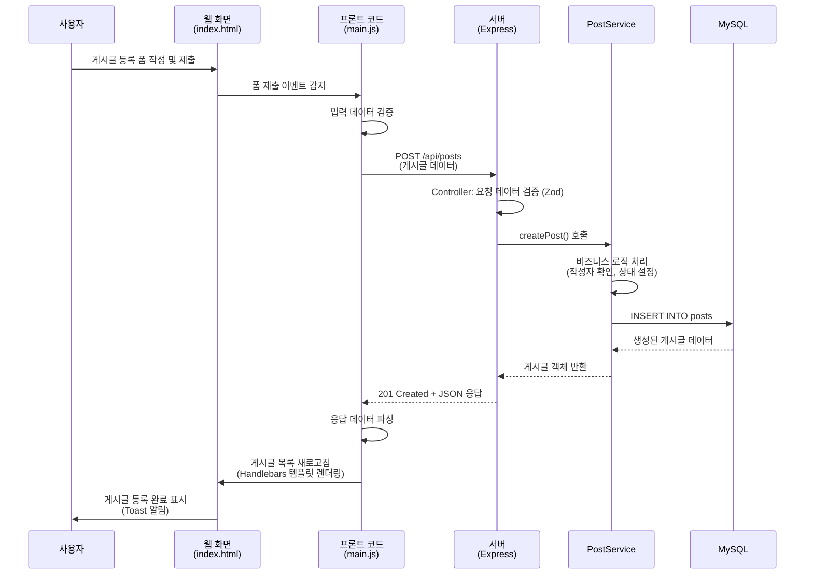
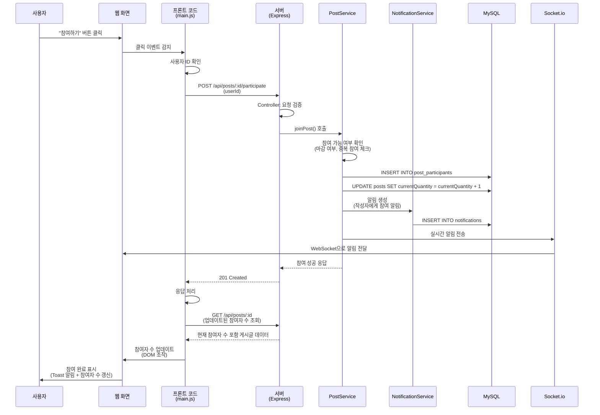
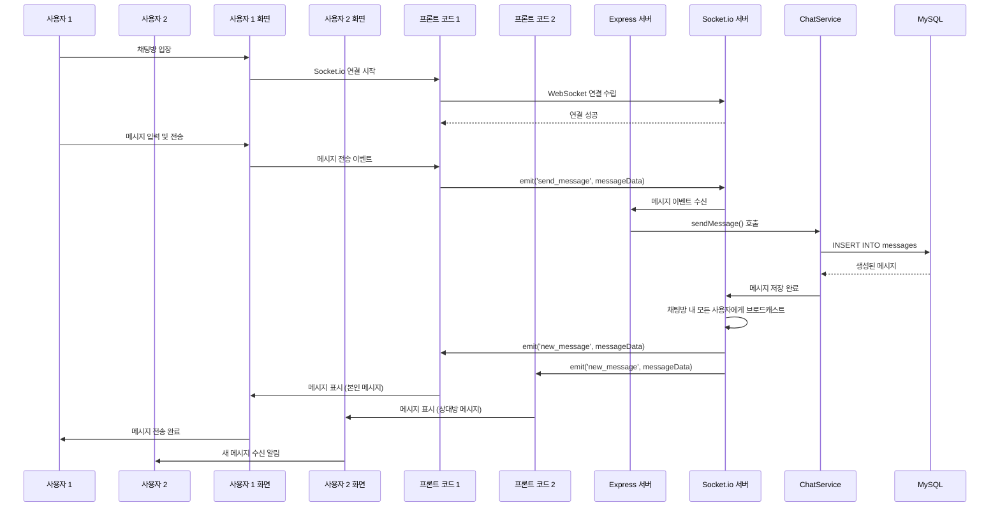
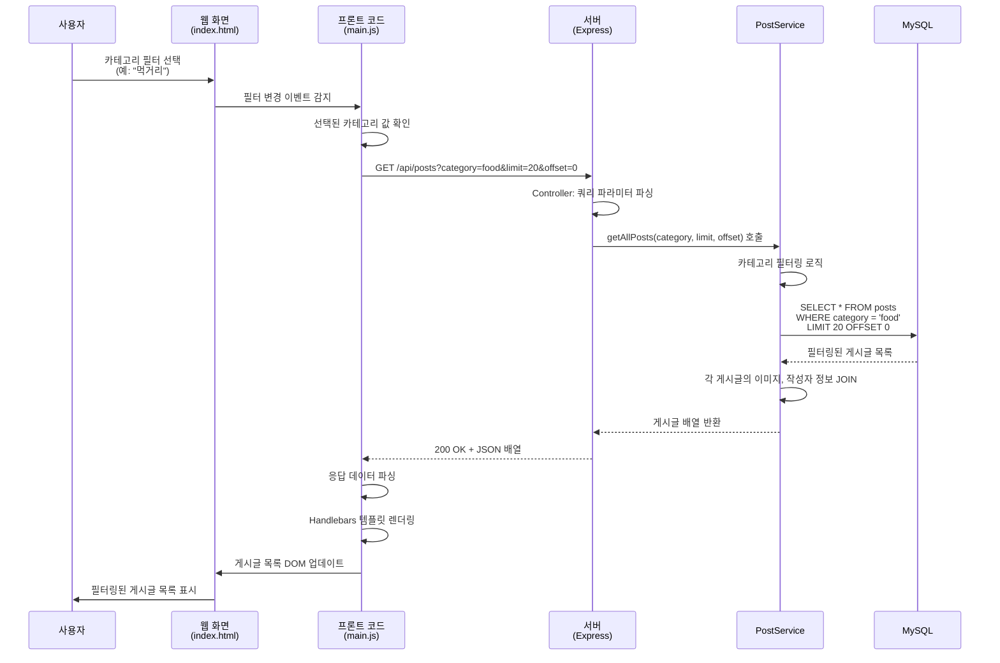
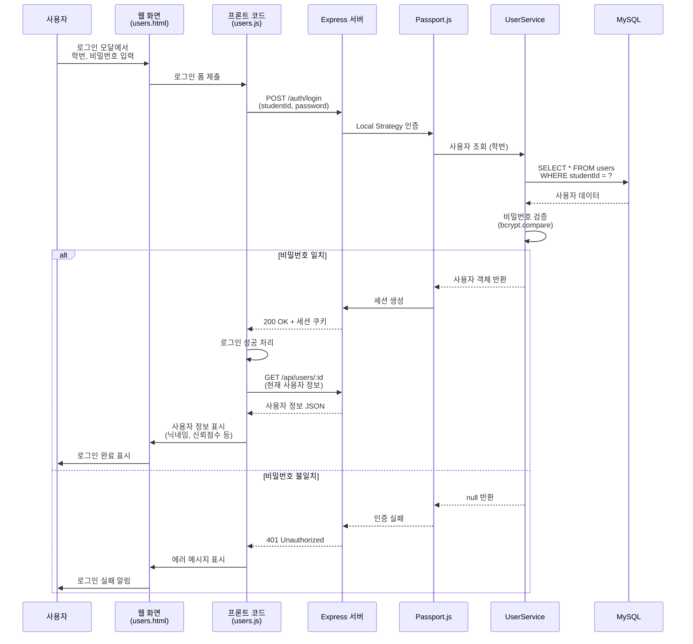
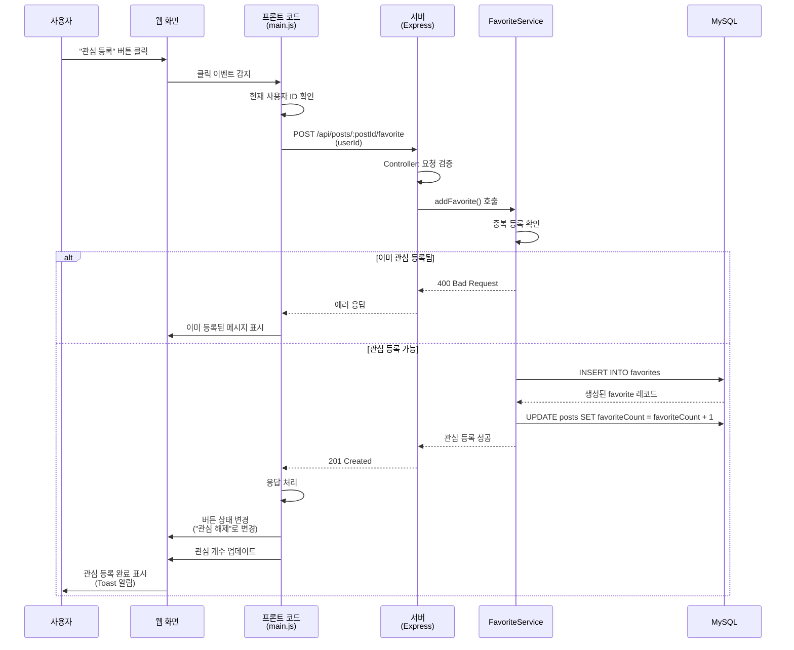
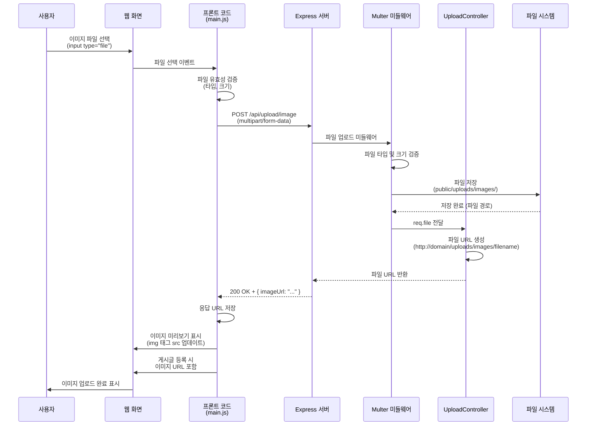
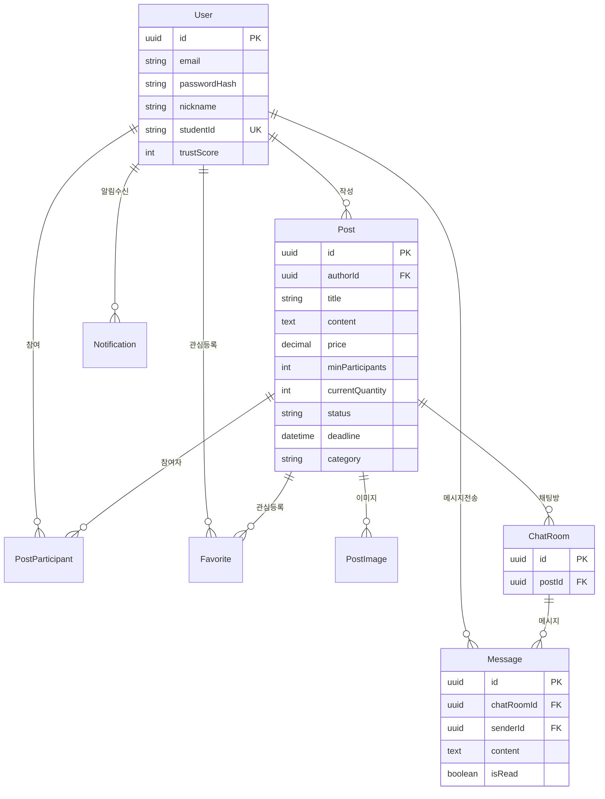

# 프로젝트 설명 문서 (이전 버전)

---

## 첫 페이지

| 항목                     | 내용                                                      |
| ------------------------ | --------------------------------------------------------- |
| **과목명**               | 고급웹프로그래밍 (Advanced Web Programming)               |
| **프로젝트 이름 (주제)** | Thomas Anderson - 공동구매 플랫폼 (Group Buying Platform) |
| **이름**                 | 최원빈                                                    |
| **학번**                 | 60203042                                                  |

---

## 1. 프로젝트 개요

**Thomas Anderson**는 명지대학교 학생들을 위한 공동구매 플랫폼입니다. 학생들이 상품을 공동으로 구매하여 할인 혜택을 누릴 수 있도록 지원하며, 실시간 채팅, 신뢰점수 시스템, 카테고리 필터링 등 다양한 기능을 제공합니다.

### 기술 스택

- **Backend**: Node.js, Express.js, TypeScript
- **Database**: MySQL (Sequelize ORM)
- **Real-time**: Socket.io
- **Authentication**: Passport.js (Local, Kakao)
- **API Documentation**: Swagger
- **Frontend**: Bootstrap, Handlebars, Vanilla JavaScript

---

## 2. 코드 구성 (폴더 별 소스코드 이름 및 기능 설명)

### 📁 `src/` - 소스코드 루트 디렉토리

#### 📁 `server.ts` - 서버 진입점

- Express 애플리케이션 구동
- 데이터베이스 연결 및 초기화
- Socket.io 서버 설정
- HTTP 서버 시작

#### 📁 `app.ts` - Express 애플리케이션 설정

- 미들웨어 설정 (CORS, Body Parser, Session, Passport)
- 정적 파일 제공
- 라우터 등록
- 글로벌 에러 핸들러
- Swagger 문서 설정

---

### 📁 `routes/` - API 라우트 정의

#### 📁 `routes/index.ts` - 라우트 통합

- 모든 API 라우터를 `/api` 경로 하위에 통합
- User, Post, Upload, Chat, Notification 라우터 등록

#### 📁 `routes/users/UserRoutes.ts` - 사용자 관련 API

- `GET /api/users` - 전체 사용자 조회 (페이징)
- `POST /api/users` - 회원가입
- `POST /api/users/login` - 로그인 (학번 + 비밀번호)
- `GET /api/users/:id` - 사용자 정보 조회
- `PUT /api/users/:id` - 회원 정보 수정
- `DELETE /api/users/:id` - 회원 삭제
- `GET /api/users/:userId/favorites` - 관심 등록한 게시글 목록

#### 📁 `routes/posts/PostRoutes.ts` - 게시글 관련 API

- `GET /api/posts` - 전체 게시글 조회 (카테고리 필터링, 페이징)
- `GET /api/posts/student/:studentId` - 학번별 게시글 조회
- `GET /api/posts/:id` - 게시글 상세 조회
- `POST /api/posts` - 게시글 등록
- `PUT /api/posts/:id` - 게시글 수정
- `PATCH /api/posts/:id/status` - 게시글 상태 변경
- `DELETE /api/posts/:id` - 게시글 삭제
- `POST /api/posts/:id/participate` - 공동구매 참여
- `DELETE /api/posts/:id/participate/:userId` - 참여 취소
- `GET /api/posts/:id/participants` - 참여자 목록
- `POST /api/posts/:postId/favorite` - 관심 등록
- `DELETE /api/posts/:postId/favorite/:userId` - 관심 해제

#### 📁 `routes/chat/ChatRoutes.ts` - 채팅 관련 API

- `POST /api/chat/rooms` - 채팅방 생성
- `GET /api/chat/rooms/user/:userId` - 사용자의 채팅방 목록
- `GET /api/chat/rooms/post/:postId` - 게시글별 채팅방 조회/생성
- `GET /api/chat/rooms/:id` - 채팅방 상세 조회
- `POST /api/chat/messages` - 메시지 전송
- `GET /api/chat/rooms/:chatRoomId/messages` - 메시지 목록 조회
- `PATCH /api/chat/messages/:id/read` - 메시지 읽음 처리
- `PATCH /api/chat/rooms/:chatRoomId/read-all` - 전체 읽음 처리
- `GET /api/chat/rooms/:chatRoomId/unread-count` - 읽지 않은 메시지 수

#### 📁 `routes/upload/UploadRoutes.ts` - 파일 업로드 API

- `POST /api/upload/image` - 이미지 업로드 (Multer)

#### 📁 `routes/notifications/NotificationRoutes.ts` - 알림 관련 API

- `GET /api/notifications/user/:userId` - 사용자 알림 목록
- `PATCH /api/notifications/:id/read` - 알림 읽음 처리

#### 📁 `routes/auth/AuthRoutes.ts` - 인증 관련 라우트

- `POST /auth/login` - 세션 기반 로그인 (Local, Kakao)
- `POST /auth/logout` - 로그아웃

#### 📁 `routes/common/validation/` - 요청 검증 스키마

- `parseReq.ts` - Zod를 이용한 요청 검증 유틸리티
- `user-schemas.ts` - 사용자 관련 스키마
- `post-schemas.ts` - 게시글 관련 스키마
- `chat-schemas.ts` - 채팅 관련 스키마
- `post-status-schemas.ts` - 게시글 상태 변경 스키마

---

### 📁 `controllers/` - 컨트롤러 (요청 처리 로직)

- `user.controller.ts` - 사용자 관련 비즈니스 로직 처리
- `post.controller.ts` - 게시글 관련 비즈니스 로직 처리
- `chat.controller.ts` - 채팅 관련 비즈니스 로직 처리
- `favorite.controller.ts` - 관심 등록 관련 로직 처리
- `notification.controller.ts` - 알림 관련 로직 처리
- `upload.controller.ts` - 파일 업로드 처리

**기능**:

- 요청 데이터 검증 (Zod 스키마)
- Service 계층 호출
- 응답 데이터 변환 및 반환
- 에러 처리

---

### 📁 `services/` - 서비스 계층 (비즈니스 로직)

- `UserService.ts` - 사용자 관련 비즈니스 로직
  - 회원가입 시 비밀번호 해시화
  - 로그인 인증 처리
  - 신뢰점수 계산 및 업데이트

- `PostService.ts` - 게시글 관련 비즈니스 로직
  - 게시글 생성/수정/삭제
  - 상태 변경 로직
  - 참여자 관리
  - 카테고리 필터링

- `ChatService.ts` - 채팅 관련 비즈니스 로직
  - 채팅방 생성 및 관리
  - 메시지 전송 및 읽음 처리
  - Socket.io 실시간 통신 연동

- `FavoriteService.ts` - 관심 등록 관련 로직
- `NotificationService.ts` - 알림 생성 및 관리

**기능**:

- 도메인 규칙 처리
- Repository 계층 호출
- 트랜잭션 관리
- 비즈니스 로직 검증

---

### 📁 `repos/` - Repository 계층 (데이터 접근)

- `UserRepo.ts` - 사용자 데이터 접근
- `PostRepo.ts` - 게시글 데이터 접근
- `ChatRoomRepo.ts` - 채팅방 데이터 접근
- `MessageRepo.ts` - 메시지 데이터 접근
- `FavoriteRepo.ts` - 관심 등록 데이터 접근
- `NotificationRepo.ts` - 알림 데이터 접근
- `PostParticipantRepo.ts` - 게시글 참여자 데이터 접근

**기능**:

- Sequelize ORM을 통한 데이터베이스 쿼리
- 복잡한 JOIN 및 집계 쿼리 처리
- 데이터 변환 및 매핑

---

### 📁 `models/` - 데이터베이스 모델

- `User.ts` - 사용자 모델
  - 필드: id, email, passwordHash, nickname, studentId, department, avatarUrl, trustScore

- `Post.ts` - 게시글 모델
  - 필드: id, authorId, title, content, price, minParticipants, currentQuantity, status, deadline, pickupLocation, category

- `PostImage.ts` - 게시글 이미지 모델
- `ChatRoom.ts` - 채팅방 모델
- `Message.ts` - 메시지 모델
- `PostParticipant.ts` - 게시글 참여자 모델
- `Favorite.ts` - 관심 등록 모델
- `Notification.ts` - 알림 모델

**기능**:

- Sequelize 모델 정의
- 테이블 관계 설정 (Association)
- 데이터 타입 및 제약조건 정의

---

### 📁 `config/` - 설정 파일

- `passport.ts` - Passport.js 인증 설정
  - Local Strategy (학번 + 비밀번호)
  - Kakao Strategy (카카오 소셜 로그인)

- `socket.ts` - Socket.io 설정
  - 실시간 채팅 연결 관리
  - 이벤트 핸들러 설정

- `multer.ts` - 파일 업로드 설정
  - 이미지 업로드 디렉토리 설정
  - 파일 타입 및 크기 제한

- `swagger.ts` - Swagger API 문서 설정

---

### 📁 `views/` - 프론트엔드 뷰 파일

- `index.html` - 메인 대시보드 및 상품 목록 페이지
- `posts.html` - 내 상품 관리 페이지
- `users.html` - 회원 관리 페이지
- `chat.html` - 채팅 페이지

---

### 📁 `public/` - 정적 파일

#### 📁 `public/scripts/` - 클라이언트 사이드 JavaScript

- `main.js` - 메인 페이지 인터랙션 로직
  - 게시글 목록 조회 및 표시
  - 게시글 등록/수정/삭제
  - 공동구매 참여
  - 관심 등록/해제
  - Handlebars 템플릿 렌더링

- `posts.js` - 게시글 관리 페이지 로직
- `users.js` - 회원 관리 페이지 로직

#### 📁 `public/stylesheets/` - CSS 스타일시트

- `main.css` - 공통 스타일
- `posts.css` - 게시글 관련 스타일
- `users.css` - 회원 관련 스타일

#### 📁 `public/uploads/images/` - 업로드된 이미지 저장소

---

### 📁 `common/` - 공통 유틸리티

- `constants/ENV.ts` - 환경 변수 상수
- `constants/HttpStatusCodes.ts` - HTTP 상태 코드
- `constants/Paths.ts` - API 경로 상수
- `util/route-errors.ts` - 라우트 에러 처리
- `util/misc.ts` - 기타 유틸리티 함수

---

### 📁 `db/` - 데이터베이스 설정

- `index.ts` - Sequelize 인스턴스 및 연결 설정

---

## 3. 추가 기능 (강조 설명)

### 🎯 **실시간 채팅 기능 (WebSocket)**

- Socket.io를 활용한 실시간 양방향 통신
- 게시글별 채팅방 자동 생성
- 읽음/안 읽음 상태 관리
- 실시간 메시지 알림

### ⭐ **신뢰점수 시스템 (Trust Score)**

- 사용자의 공동구매 활동 기반 신뢰도 수치화
- 활동에 따른 자동 점수 조정
- 등급 시스템 (최우수/우수/보통/주의/경고)
- 신뢰할 수 있는 거래 상대방 식별 가능

### 🗂️ **카테고리 필터링**

- 6가지 카테고리 제공 (먹거리, 일상용품, 뷰티·패션, 전자기기, 학용품, 프리마켓)
- 카테고리별 게시글 필터링 및 검색
- API 쿼리 파라미터를 통한 필터링

### 🔐 **소셜 로그인 (Kakao)**

- Passport.js를 통한 카카오 OAuth 인증
- 세션 기반 인증 관리
- 기존 Local 로그인과 병행 지원

### 📝 **API 문서화 (Swagger)**

- OpenAPI 3.0 스펙 기반 API 문서
- 인터랙티브 API 테스트 환경 제공
- 동적 서버 URL 지원

---

## 4. 사용자 인터렉션에 대한 서버의 서비스 도식화

### 전체 시스템 아키텍처

```mermaid
flowchart TB
    subgraph Client["클라이언트 (브라우저)"]
        View["HTML Views<br/>(index.html, posts.html, etc.)"]
        Script["JavaScript<br/>(main.js, posts.js, etc.)"]
        Socket["Socket.io Client"]
    end

    subgraph Express["Express 서버"]
        Middleware["미들웨어<br/>(CORS, Body Parser, Session)"]
        Router["라우터<br/>(/api/*)"]
        Controller["컨트롤러<br/>(요청 검증, 처리)"]
        Service["서비스 계층<br/>(비즈니스 로직)"]
        Repo["Repository 계층<br/>(데이터 접근)"]
    end

    subgraph Database["데이터베이스"]
        MySQL["MySQL<br/>(Sequelize ORM)"]
    end

    subgraph RealTime["실시간 통신"]
        SocketIO["Socket.io Server"]
    end

    View -->|사용자 인터렉션| Script
    Script -->|HTTP 요청<br/>(fetch API)| Router
    Router -->|라우팅| Controller
    Controller -->|비즈니스 로직 호출| Service
    Service -->|데이터 접근| Repo
    Repo -->|SQL 쿼리| MySQL
    MySQL -->|데이터 반환| Repo
    Repo -->|결과 반환| Service
    Service -->|처리 결과| Controller
    Controller -->|JSON 응답| Script
    Script -->|DOM 업데이트| View

    Socket -->|WebSocket 연결| SocketIO
    SocketIO -->|실시간 메시지| Socket
```

---

## 5. 사용자 인터렉션 종류별 흐름 도식화

### 5.1. 게시글 등록 플로우



---

### 5.2. 공동구매 참여 플로우



---

### 5.3. 실시간 채팅 플로우



---

### 5.4. 게시글 목록 조회 (카테고리 필터링) 플로우



---

### 5.5. 로그인 플로우 (Local Strategy)



---

### 5.6. 관심 등록 플로우



---

### 5.7. 이미지 업로드 플로우



---

## 6. 주요 데이터베이스 관계



---

## 7. 프로젝트 실행 방법

### 개발 환경 설정

```bash
# 1. 의존성 설치
npm install

# 2. 환경 변수 설정 (.env 파일 생성)
DB_HOST=localhost
DB_PORT=3306
DB_NAME=damara
DB_USER=root
DB_PASSWORD=your_password
NODE_ENV=development
PORT=3000

# 3. 개발 서버 실행
npm run dev

# 4. 프로덕션 빌드
npm run build
npm start
```

### 접속 URL

- **메인 페이지**: `http://localhost:3000/`
- **게시글 관리**: `http://localhost:3000/posts`
- **회원 관리**: `http://localhost:3000/users`
- **채팅**: `http://localhost:3000/chat`
- **API 문서**: `http://localhost:3000/api-docs`

---

## 8. 프로젝트 특징 요약

### ✅ **계층적 아키텍처**

- Controller → Service → Repository → Model 계층 분리
- 각 계층의 책임 명확화
- 코드 재사용성 및 유지보수성 향상

### ✅ **타입 안정성**

- TypeScript를 통한 타입 검증
- 컴파일 타임 에러 방지

### ✅ **실시간 통신**

- Socket.io를 통한 양방향 실시간 통신
- 채팅, 알림 등 즉각적인 피드백 제공

### ✅ **보안**

- Passport.js를 통한 안전한 인증
- 비밀번호 해시화 (bcrypt)
- 세션 기반 인증 관리

### ✅ **확장성**

- 모듈화된 구조
- Swagger를 통한 API 문서화
- 페이징 및 필터링 지원

---

**문서 작성일**: 2025년 11월 24일  
**프로젝트 버전**: 0.0.0

